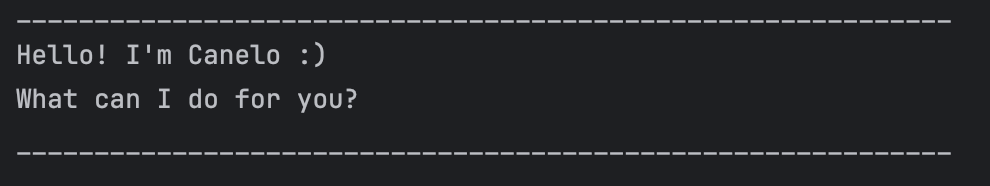

# Canelo User Guide

Canelo is an interactive chatbot and task tracker program.

## Features

### Notes about the command format
- Words in `UPPER_CASE` are the parameters to be supplied by the user.
  e.g. in `todo DESCRIPTION`, `DESCRIPTION` is a parameter which can be used as `todo buy book`.
- Parameters must be in the specified order.
- Extraneous parameters for commands that do not take in parameters (such as `list`) will be ignored.
  e.g. if the command specifies `list 123`, it will be interpreted as `list`.

###  Showing all tasks in the task list: `list`

Prints out all tasks in the task list.

Format: `list`

### Adding todo task: `todo`

Adds a todo task to the task list.

Format: `todo DESCRIPTION`

Examples:
- `todo pilates`
- `todo pay electricity bill`

### Adding deadline task: `deadline`

Adds a deadline task to the task list.

Format: `deadline DESCRIPTION /by BY`

Examples:
- `deadline finish homework /by Friday 11:59pm`

### Adding event task: `event`

Adds an event task to the task list.

Format: `event DESCRIPTION /from FROM /to TO`

Examples:
- `event birthday dinner /from 6pm /to 8pm`

### Marking a task as done: `mark`

Marks the specified task as done.

Format: `mark INDEX`
- Marks the task at the specified INDEX as done.
- The index refers to the index number shown in the displayed task list.
- The index must be a positive integer 1, 2, 3, …​

Examples:
- `mark 3`

### Marking a task as not done: `unmark`

Marks the specified task as not done.

Format: `unmark INDEX`
- Marks the task at the specified INDEX as done.
- The index refers to the index number shown in the displayed task list.
- The index must be a positive integer 1, 2, 3, …​

Examples:
- `unmark 5`

### Finding a task by search word: `find`

Marks the specified task as not done.

Format: `find SEARCHWORD`
- The search is case-sensitive. e.g `buy` will not match `Buy`
- The entire description is matched. e.g. `sun` will match `sunflower`
- `SEARCHWORD` can be multiple words that are space-separated.

Examples:
- `find psychology`
- `find library book`

### Deleting a task: `delete`

Deletes a specified task from the task list.

Format: `delete INDEX`
- Removes the task at the specified index from the task list.
- The index refers to the index number shown in the displayed task list.
- The index must be a positive integer 1, 2, 3, …​

Examples:
- `delete 2`

### Exiting the program: `bye`

Exits the chatbot.

Format: `bye`

### Saving the data

Canelo data are saved in the hard disk automatically after any command that changes the data. There is no need to save manually.
